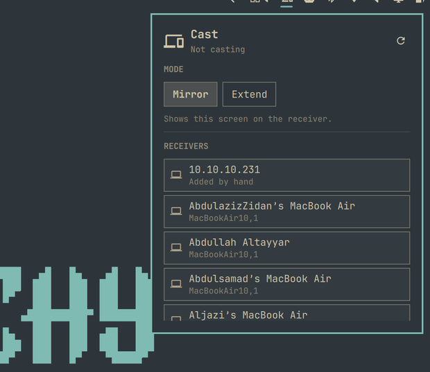

# Cast indicator

A bar widget for [Omarchy](https://omarchy.org) that casts your screen to an
Apple TV or a Chromecast — mirror it, or extend onto an Apple TV as a second
desktop — and shows what is casting.



Click the icon for a panel listing the receivers on your network. Pick a mode
once, click a receiver, and it casts. Televisions sort above laptops, because a
colleague's MacBook answering AirPlay is noise. Right-click the icon to stop.

Extend is AirPlay only. A Chromecast row says "Mirror only" when Extend is
selected, and mirrors — rather than letting a click start a cast that cannot
work.

## Requires castr

The widget is a front end for [`castr`](https://github.com/mrCode/castr), which
does the actual work. Install it first:

```bash
yay -S castr
```

Without it the widget says so and tells you this command, rather than sitting
there looking idle.

castr then needs whichever backend you cast with — `doubletake-git` for an
Apple TV, GStreamer for a Chromecast — and neither is involved in the other's
cast. castr's [Installing](https://github.com/mrCode/castr#installing) section
has both, and castr names the missing one rather than failing obscurely.

If you run a firewall, it has to let the receiver reach your machine — neither
protocol is one-way:

| port | why |
|---|---|
| UDP 5353 | mDNS, so receivers are discovered at all |
| TCP + UDP 60000-60010 | the range an Apple TV connects into to fetch the stream |
| TCP 8010 | where a Chromecast fetches the stream from |

A Chromecast also needs GStreamer, which castr's package lists as optional
dependencies — the Chromecast capture is castr's own code rather than
doubletake's.

Without those, discovery finds nothing or a cast starts and then stalls.
castr's README carries the exact `ufw` commands:
[Installing](https://github.com/mrCode/castr#installing).

## Install

```bash
omarchy plugin add https://github.com/mrCode/castr-indicator.git --enable --yes
```

## Remove

```bash
omarchy plugin remove castr.indicator
```

That takes the widget out of the bar and deletes its checkout. It leaves
`castr` itself alone; uninstall that separately with your package manager if
you want it gone too. The widget stores nothing of its own — everything it
shows comes from asking `castr` — so there is no leftover state to clean up.

## What it shows

- **Idle** — a dim icon; the panel lists what it can cast to
- **Connecting** — a screen-share prompt may be waiting for you; answer it
- **Streaming** — the receiver and mode, with a stop button
- **Failed** — what went wrong, in the receiver's own words where there are any

The icon stays visible whether or not you are casting. A control you cannot see
is a control you cannot find, and this one is how you stop.

## Mirror and extend

**Mirror** sends the screen you pick at the share prompt. Your panel keeps its
own resolution and refresh rate — castr does not touch it.

**Extend** gives you a second desktop. When the share prompt appears, pick the
output named `castr`, not your own screen; the portal remembers that choice.
If you pick wrong, `castr reset-share extend` asks again without making you
re-pair with the television.

## How it talks to castr

Three commands, all of them read-only until you click something:

| command | when |
|---|---|
| `castr bar` | polled every 2s; never starts a daemon |
| `castr list --json` | only while the panel is open |
| `castr status --json` | only while the panel is open |

Polling `castr bar` cannot start or keep alive a background daemon, so an idle
machine stays idle.

## Licence

MIT. Plugins run unsandboxed inside `omarchy-shell`; the source here is one QML
file, and it is worth the two minutes to read before you enable it.
